## Application Flow
<details>
  <summary><strong>Click to expand Data Flow</strong></summary>

  

  ```mermaid
flowchart TD
    subgraph INPUT["Input layer"]
        GF["Google Forms\nBasic data entry"]
        GS["Google Sheets\nData store + Apps Script validation"]
        MODAL["Modal form\nApps Script HTML UI"]
    end

    subgraph ETL["ETL — Apps Script (daily trigger)"]
        AS["Reads sheet rows\nBuilds + validates JSON"]
    end

    subgraph STORAGE["Storage — GitHub"]
        API["GitHub Contents API\nPOST/PUT file"]
        JSON["bp_readings.json\nGitHub Pages / raw URL"]
    end

    subgraph SPA["Client — SPA"]
        LOAD["bp_data_loader.js\nfetch() on page load"]
        NORM["bp_data_normalized.js\nParse · validate · categorise"]
        FILT["bp_filters.js\nDate window filter"]
        CHARTS["bp_charts.js\nDispatch → render all charts"]
    end

    GF -->|"appends row"| GS
    MODAL -->|"appends row"| GS
    GS --> AS
    AS -->|"GitHub API"| API
    API --> JSON
    JSON -->|"fetch()"| LOAD
    LOAD -->|"bpDataLoaded event"| NORM
    NORM --> FILT
    FILT --> CHARTS
```
</details>
